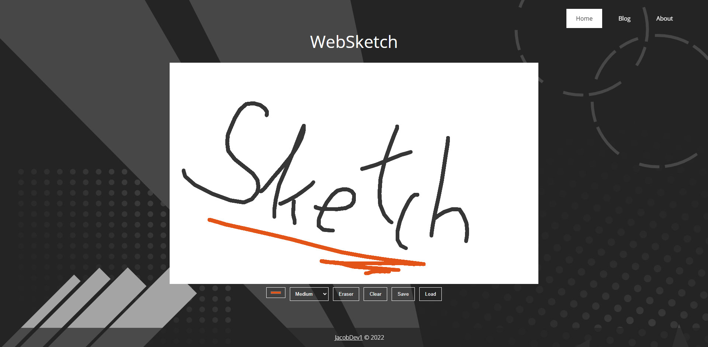

## WebSketch
A web-based drawing program for desktop, mobiles and graphic tablets.

WebSketch has been built without any third-party libraries. It was made as a  final year project for school, so it lacks any long term support.

There is a blog tab where you can see how it was progressively developed.

### Shortcuts
- **Draw:** Left Click
- **Toggle Eraser:** E
- **Change Brush Size:** 1 - 5
- **Color Picker:** P
- **Save:** Ctrl + S
- **Load:** Ctr + O
- **Clear Canvas:** Ctrl + X